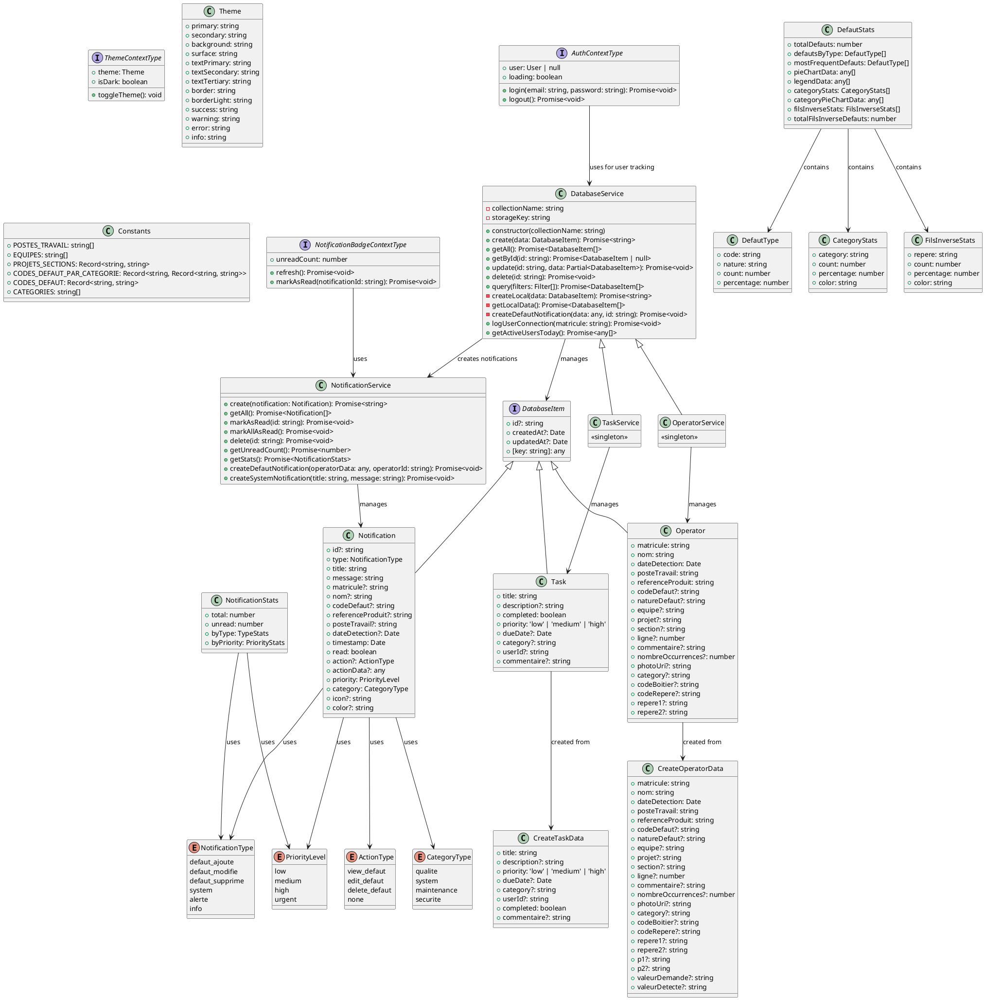

# Diagramme de Classes - Application Mobile Qualité LEONI

## Diagramme UML (PlantUML)

## Description des Classes Principales

### 1. **Entités Métier**

#### `Operator` (extends DatabaseItem)
- **Rôle** : Représente un défaut détecté par un opérateur
- **Attributs clés** : matricule, nom, dateDetection, codeDefaut, natureDefaut
- **Relations** : Hérite de DatabaseItem, créé via CreateOperatorData

#### `Task` (extends DatabaseItem)
- **Rôle** : Représente une tâche générique du système
- **Attributs clés** : title, completed, priority, dueDate
- **Relations** : Hérite de DatabaseItem, créé via CreateTaskData

#### `Notification` (extends DatabaseItem)
- **Rôle** : Représente les notifications système
- **Attributs clés** : type, title, message, priority, read
- **Relations** : Utilise les énumérations pour typage strict

### 2. **Services**

#### `DatabaseService`
- **Rôle** : Service générique pour la gestion des données (Firebase + cache local)
- **Méthodes principales** : CRUD operations, synchronisation, cache local
- **Pattern** : Template method avec fallback local storage

#### `NotificationService`
- **Rôle** : Service spécialisé pour les notifications
- **Méthodes principales** : Création, lecture, statistiques
- **Relations** : Utilisé par DatabaseService pour créer des notifications

### 3. **Contextes React**

#### `AuthContextType`
- **Rôle** : Gestion de l'authentification Firebase
- **Méthodes** : login, logout, état utilisateur

#### `ThemeContextType`
- **Rôle** : Gestion des thèmes (clair/sombre)
- **Méthodes** : toggleTheme, état du thème

#### `NotificationBadgeContextType`
- **Rôle** : Gestion des badges de notification
- **Méthodes** : refresh, markAsRead, compteur non lus

### 4. **Types de Données**

#### `DefautStats`
- **Rôle** : Agrégation des statistiques de défauts
- **Composition** : Contient DefautType[], CategoryStats[], FilsInverseStats[]

#### `NotificationStats`
- **Rôle** : Statistiques des notifications
- **Composition** : Compteurs par type et priorité

### 5. **Énumérations**
- `NotificationType` : Types de notifications
- `ActionType` : Actions possibles sur notifications
- `PriorityLevel` : Niveaux de priorité
- `CategoryType` : Catégories de notifications

## Patterns Architecturaux Utilisés

1. **Repository Pattern** : DatabaseService comme couche d'abstraction
2. **Singleton Pattern** : Services instanciés une seule fois
3. **Strategy Pattern** : Fallback Firebase → Local Storage
4. **Observer Pattern** : Contextes React pour état global
5. **Factory Pattern** : Création d'objets via interfaces Create*Data

## Relations Clés

- **Héritage** : Operator, Task, Notification héritent de DatabaseItem
- **Composition** : DefautStats compose plusieurs types de statistiques
- **Dépendance** : Services dépendent des interfaces métier
- **Association** : Contextes utilisent les services pour les opérations
